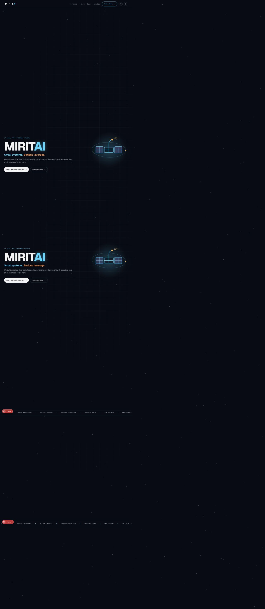

# MIRITAI visual milestone: studio system

Date: 29 August 2026

This record preserves the visual direction that preceded the portfolio and practice hub redesign. The working reference was the development site running from `/Users/cgveradia/miritai-website`; the canonical repository is `/Users/cgveradia/Mirit/miritai-website`.

## Character of this version

- Dark technical interface with cyan, violet, and orange accents
- Sputnik-inspired hero illustration and signal motif
- Grid overlays, monospace labels, numbered modules, and a moving capability ticker
- Service-studio positioning centred on data, automation, and web systems
- Rounded calls to action, diagrammatic cards, and light/dark themes

## Why the design evolved

The visual language was recognisable but leaned heavily on conventions common to AI and software studio sites. The next iteration keeps the sense of exploration while becoming more personal, editorial, and suitable for a portfolio and practice hub. It also moves the implementation from a large global stylesheet toward Tailwind utilities, shared components, and a small intentional base layer.

Git history remains the authoritative record of implementation changes. This document exists as a human-readable visual checkpoint.
